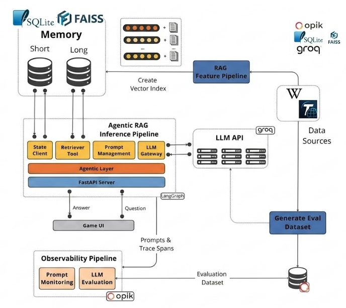
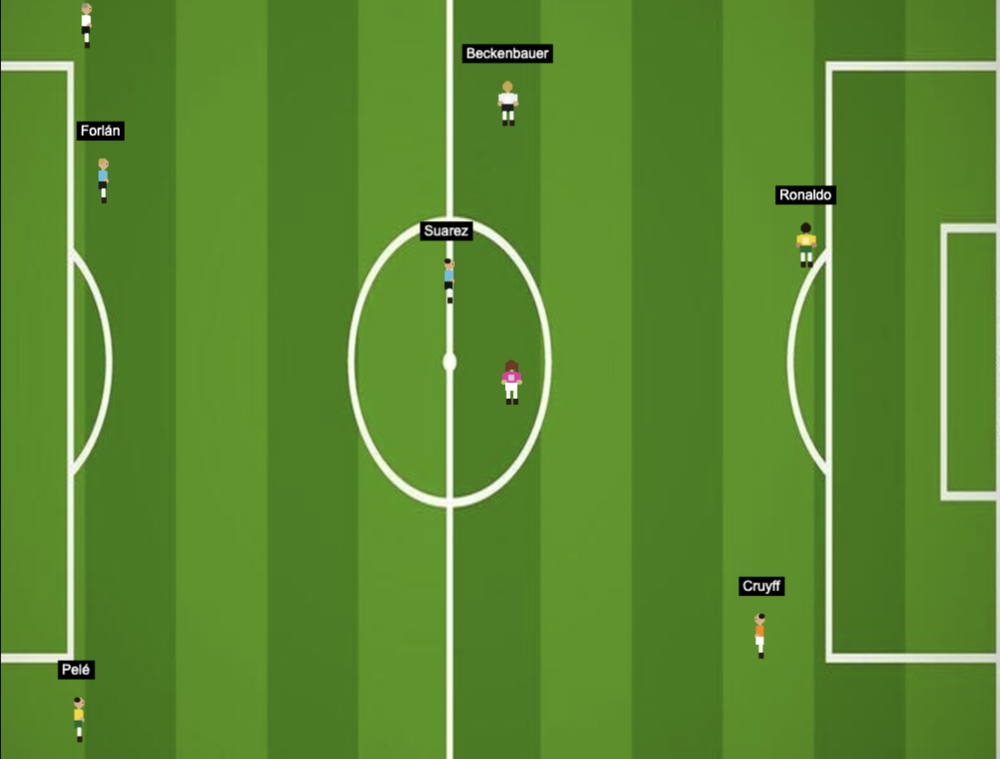

<div align="center">
  <h1>FutbolAgents</h1>
  <h3>An AI-powered game simulation engine where you talk to legendary football (soccer) players.</h3>
  <p class="tagline">Built by <a href="https://github.com/JoseMorei">Jose Moreira</a>, forked and adapted from <a href="https://github.com/neural-maze/philoagents-course">PhiloAgents</a> by The Neural Maze & Decoding ML.</p>
</div>

</br>

<p align="center">
    
</p>

## 📖 About This Project

**FutbolAgents** is a personal project forked and heavily modified from [PhiloAgents](https://github.com/neural-maze/philoagents-course), an open-source course that teaches how to build an AI-powered game simulation engine to impersonate historical philosophers.

In FutbolAgents, the philosophers are replaced by **legendary football (soccer) players**. You can have conversations with the greatest players in history — each with their own style, personality, and football philosophy.

The project preserves the core agentic RAG architecture from PhiloAgents but introduces several key technical changes described below.

---

## ⚽ Meet the Legends

FutbolAgents lets you talk to these iconic football players:

| Player | Country | Known For |
|--------|---------|-----------|
| **Diego Maradona** | 🇦🇷 Argentina | The Hand of God, the Goal of the Century |
| **Johan Cruyff** | 🇳🇱 Netherlands | Total Football, tactical genius |
| **Pelé** | 🇧🇷 Brazil | Three World Cups, the beautiful game |
| **Ronaldo Nazário** | 🇧🇷 Brazil | The Phenomenon, 2002 World Cup |
| **Luis Suárez** | 🇺🇾 Uruguay | Relentless hunger, clinical finishing |
| **Diego Forlán** | 🇺🇾 Uruguay | 2010 World Cup Golden Ball |
| **Franz Beckenbauer** | 🇩🇪 Germany | The Kaiser, revolutionary libero |
| **Alfredo Di Stéfano** | 🇦🇷🇪🇸 Argentina/Spain | Five European Cups with Real Madrid |
| **Ferenc Puskás** | 🇭🇺 Hungary | The Mighty Magyars, pure technique |
| **Garrincha** | 🇧🇷 Brazil | Joy, dribbling magic, football freedom |

---


<p align="center">
  
  
</p>

## 🔧 Key Changes from PhiloAgents

### 1. Based on PhiloAgents
This project is directly forked from [PhiloAgents](https://github.com/neural-maze/philoagents-course). All credit for the original architecture, course materials, and agentic RAG design goes to The Neural Maze and Decoding ML teams.

### 2. SQLite replaces MongoDB
The original PhiloAgents used **MongoDB** for both short-term and long-term memory storage. In FutbolAgents, MongoDB has been replaced by **SQLite** — a lightweight, file-based relational database that requires no external service or cloud connection, making local development significantly simpler.

### 3. FAISS for vector search
**FAISS** (Facebook AI Similarity Search) has been added as the vector search engine for the RAG (Retrieval-Augmented Generation) pipeline. FAISS provides fast and efficient similarity search over dense vector embeddings entirely in-memory and locally, removing the need for a managed vector database.

### 4. New LLM: Meta Llama 4 Scout
The LLM backbone has been upgraded from `llama-3.1-8b-instant` to:

```
meta-llama/llama-4-scout-17b-16e-instruct
```

This model is served via [Groq](https://groq.com) for high-speed inference.

### 5. New Data Sources
The original PhiloAgents scraped data from **Wikipedia** and the **Stanford Encyclopedia of Philosophy** to build the long-term memory of each philosopher.

In FutbolAgents, the Stanford Encyclopedia of Philosophy has been replaced by **[Transfermarkt.com](https://www.transfermarkt.com)** — a comprehensive football statistics and career data website. Data sources are now:

- **Wikipedia** — biographical information and career overviews
- **Transfermarkt.com** — career stats, transfers, and football-specific data

### 6. Components Tested but Discarded

During development, several components were evaluated but ultimately not included in the final product:

| Component | What it is | Why discarded |
|-----------|-----------|---------------|
| **[Ollama](https://ollama.com)** | A tool for running large language models locally on your machine | Replaced by Groq API for better speed and convenience |
| **[Qwen LLM](https://huggingface.co/Qwen)** | An open-source LLM family by Alibaba Cloud | Replaced by Meta's Llama 4 Scout for better performance on this task |
| **[Typesense](https://typesense.org)** | An open-source, typo-tolerant search engine optimized for fast, full-text search | Not needed once FAISS was chosen for vector similarity search |

---

## 🏗️ Project Structure

```bash
.
├── futbolagents-api/     # Backend API containing the FutbolAgents simulation engine (Python)
├── futbolagents-ui/      # Frontend UI for the game (Node)
├── static/diagrams/futbolagents_diagram.png  # Architecture diagram
└── README.md
```

The core agent logic lives in `futbolagents-api`. The `futbolagents-ui` provides the game interface.

---

## 🗃️ Dataset

Each player's long-term memory is populated with data automatically retrieved from:
- **Wikipedia** — general biography and career history
- **Transfermarkt.com** — career statistics, clubs, and achievements

No manual downloads are required. The `futbolagents-api` application fetches and processes this data at setup time.

---

## 🚀 Getting Started

Find detailed setup and usage instructions in the [INSTALL_AND_USAGE.md](INSTALL_AND_USAGE.md) file.

---

## 💡 Questions and Troubleshooting

Open a [GitHub issue](https://github.com/JoseMorei/futbolagents/issues) for:
- Technical troubleshooting
- Questions about the implementation
- Bug reports

---

## 🥂 Contributing

Feel free to fork, open issues, and submit pull requests.

1. Fork the repository
2. Create a feature branch
3. Fix the bug or add the feature
4. Open a pull request

---

## License

This project is licensed under the MIT License — see the [LICENSE](LICENSE) file for details.

---

> **FutbolAgents** is a personal adaptation of [PhiloAgents](https://github.com/neural-maze/philoagents-course). All original course content, architecture, and design credit belongs to [The Neural Maze](https://theneuralmaze.substack.com/) and [Decoding ML](https://decodingml.substack.com).
